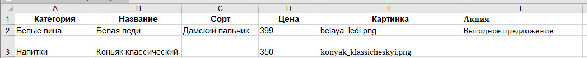

# Новое русское вино

Сайт магазина авторского вина "Новое русское вино".

## Запуск

- Скачайте код
- Установите зависимости командой `pip install -r requirements.txt`
- Создайте Excel-файл с базой вин и напитков по слудующему примеру:

- Запустите сайт командой `python3 main.py path/to/file.xlsx`
- Перейдите на сайт по адресу [http://127.0.0.1:8000](http://127.0.0.1:8000).

### Цели проекта

Код написан в образовательных целях на онлайн-курсе для веб-разработчиков [dvmn.org](https://dvmn.org/).
